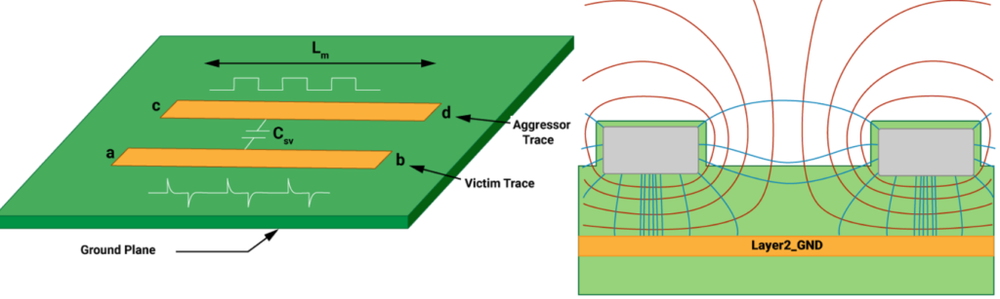

<div align="center">
    
  </a>
<h3 align="center">Electronic Hardware System Design</h3>
<h4 aling="center">Lab 1</h4>
  <p align="center">
    <br />
  </p>
</div>

## Long Paths

Enable long paths for git by

```
git config --system core.longpaths true
```

## Merging

**ONLY** fast-forward merging onto _main_ is allowed. This means that if the main branch moves during branch development, rebasing is necessary before merging. 

No merge commits allowed.

2 approvals required for PR's for _extreme code review hygge_.
